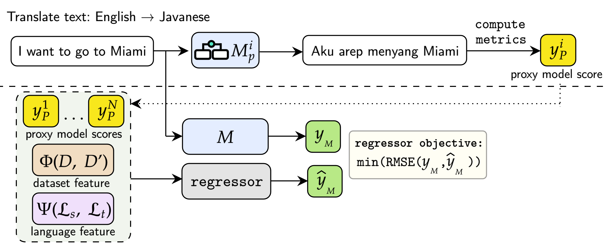

# Using ProxyLM Regressor with URIEL+

By [Mason Shipton](https://github.com/Masonshipton25), [York Hay Ng](https://github.com/Swithord)

## Contents

- [About ProxyLM](#about-proxylm)
- [About URIEL+](#about-uriel)
- [Environment](#environment)
- [Running ProxyLM Regressor](#running-proxylm-regressor)
  - [1. Distance Calculation](#1-distance-calculation)
  - [2. Updating Experiment CSVs](#2-updating-experiment-csvs)
  - [3. Changing Language Features](#3-changing-language-features)
  - [4. Running Experiments](#4-running-experiments)
  
  Optional

  - [5. Determining Statistical Significance](#5-determining-statistical-significance)

## About ProxyLM

### [ProxyLM: Predicting Language Model Performance on Multilingual Tasks via Proxy Models](https://arxiv.org/abs/2406.09334)



#### Abstract
Performance prediction is a method to estimate the performance of Language Models (LMs) on various Natural Language Processing (NLP) tasks, mitigating computational costs associated with model capacity and data for fine-tuning. Our paper introduces ProxyLM, a scalable framework for predicting LM performance using proxy models in multilingual tasks. These proxy models act as surrogates, approximating the performance of the LM of interest. By leveraging proxy models, ProxyLM significantly reduces computational overhead on task evaluations, achieving up to a 37.08x speedup compared to traditional methods, even with our smallest proxy models. Additionally, our methodology showcases adaptability to previously unseen languages in pre-trained LMs, outperforming the state-of-the-art performance by 1.89x as measured by root-mean-square error (RMSE). This framework streamlines model selection, enabling efficient deployment and iterative LM enhancements without extensive computational resources.

If you are interested for more information, check out the [full paper](https://arxiv.org/abs/2406.09334).

<u>If you use this code for your research, please cite the following work:</u>

```bibtex
@article{anugraha2024proxylm,
  title={ProxyLM: Predicting Language Model Performance on Multilingual Tasks via Proxy Models},
  author={Anugraha, David and Winata, Genta Indra and Li, Chenyue and Irawan, Patrick Amadeus and Lee, En-Shiun Annie},
  journal={arXiv preprint arXiv:2406.09334},
  year={2024}
}
```

If you have any questions, you can open a [GitHub Issue](https://github.com/davidanugraha/proxylm/issues) or send them an [email](mailto:david.anugraha@gmail.com).


## About URIEL+

### [URIEL+: Enhancing Linguistic Inclusion and Usability in a Typological and Multilingual Knowledge Base](https://arxiv.org/abs/2409.18472)


#### Abstract
URIEL is a knowledge base offering geographical, phylogenetic, and typological vector representations for 7970 languages. It includes distance measures between these vectors for 4005 languages, which are accessible via the lang2vec tool. Despite being frequently cited, URIEL is limited in terms of linguistic inclusion and overall usability. To tackle these challenges, we introduce URIEL+, an enhanced version of URIEL and lang2vec addressing these limitations. In addition to expanding typological feature coverage for 2898 languages, URIEL+ improves user experience with robust, customizable distance calculations to better suit the needs of the users. These upgrades also offer competitive performance on downstream tasks and provide distances that better align with linguistic distance studies.

If you are interested for more information, check out the [full paper](https://aclanthology.org/2025.coling-main.463/).

<u>If you use this code for your research, please cite the following work:</u>

```bibtex
@article{khan2024urielplus,
  title={URIEL+: Enhancing Linguistic Inclusion and Usability in a Typological and Multilingual Knowledge Base},
  author={Khan, Aditya and Shipton, Mason and Anugraha, David and Duan, Kaiyao and Hoang, Phuong H. and Khiu, Eric and Doğruöz, A. Seza and Lee, En-Shiun Annie},
  journal={arXiv preprint arXiv:2409.18472},
  year={2024}
}
```

If you have any questions, you can open a [GitHub Issue](https://github.com/Masonshipton25/URIELPlus/issues) or send them an [email](mailto:masonshipton25@gmail.com).

Check out ExploRIEL, the online UI for URIEL+: https://uriel-leelab.streamlit.app/ 


## Environment

Requires **Python 3.10** or later.

All dependencies are listed in the `requirements/` folder.

## Running ProxyLM Regressor

### 1. Distance Calculation

Run the following script to calculate URIEL+ distances:

```bash
python distances/calculate_distances.py
```

This will create two CSV files containing distances for the **MT560** and **NUSA** language datasets.

> Output files will be saved to the `distances/` folder.

---

### 2. Updating Experiment CSVs

After calculating distances, run:

```bash
python distances/replace_distances.py
```

This updates the experiment CSV files for MT560 and NUSA with URIEL+ distances.

> Updated experiment CSVs will be saved to `src/proxy_regressor/csv_datasets/`.

---

### 3. Changing Language Features

If you add or remove language features (e.g., introducing a new feature type), open `src\proxy_regressor\utils.py` and update the `LANG_FEATURES` list to include or exclude the appropriate language features.

### 4. Running Experiments

<details>
<summary><strong>MT560 Experiments</strong> (click to expand)</summary>

- **Random Sampling (M2M100):**
  ```bash
  python -m src.proxy_regressor.main -em random -r xgb -rj src/proxy_regressor/regressor_configs/xgb_config_mt560_m2m100.json -d mt560 -m m2m100
  ```

- **Random Sampling (NLLB):**
  ```bash
  python -m src.proxy_regressor.main -em random -r xgb -rj src/proxy_regressor/regressor_configs/xgb_config_mt560_nllb.json -d mt560 -m nllb
  ```

- **Leave-One-Language-Out (LOLO) (M2M100):**
  ```bash
  python -m src.proxy_regressor.main -em lolo -r xgb -rj src/proxy_regressor/regressor_configs/xgb_config_mt560_m2m100.json -d mt560 -m m2m100 -l all
  ```

- **Leave-One-Language-Out (LOLO) (NLLB):**
  ```bash
  python -m src.proxy_regressor.main -em lolo -r xgb -rj src/proxy_regressor/regressor_configs/xgb_config_mt560_nllb.json -d mt560 -m nllb -l all
  ```

- **Seen/Unseen (M2M100):**
  ```bash
  python -m src.proxy_regressor.main -em seen_unseen -r xgb -rj src/proxy_regressor/regressor_configs/xgb_config_mt560_m2m100.json -d mt560 -m m2m100
  ```

  After running the **Seen/Unseen (M2M100)** command, run:
  ```bash
  python unseen.py
  ```
  This will output a text file with more readable results and will output the average standard error. NOTE: For **Seen/Unseen (M2M100)** experiments, take the average of `test_source_rmse` and `test_target_rmse` for the `test_rmse`.

</details>

---

<details>
<summary><strong>NUSA Experiments</strong> (click to expand)</summary>

- **Random Sampling (M2M100):**
  ```bash
  python -m src.proxy_regressor.main -em random -r xgb -rj src/proxy_regressor/regressor_configs/xgb_config_nusa_m2m100.json -d nusa -m m2m100
  ```

- **Random Sampling (NLLB):**
  ```bash
  python -m src.proxy_regressor.main -em random -r xgb -rj src/proxy_regressor/regressor_configs/xgb_config_nusa_nllb.json -d nusa -m nllb
  ```

- **Leave-One-Language-Out (LOLO) (M2M100):**
  ```bash
  python -m src.proxy_regressor.main -em lolo -r xgb -rj src/proxy_regressor/regressor_configs/xgb_config_nusa_m2m100.json -d nusa -m m2m100 -l all
  ```

- **Leave-One-Language-Out (LOLO) (NLLB):**
  ```bash
  python -m src.proxy_regressor.main -em lolo -r xgb -rj src/proxy_regressor/regressor_configs/xgb_config_nusa_nllb.json -d nusa -m nllb -l all
  ```

</details>

---

> 📄 **Note:** After each experiment finishes, results are automatically saved to a `.csv` file. Extract the test RMSE and test SE from the CSV (you may need to average them across individual languages). Lower values indicate better performance, as RMSE measures error.

### Optional

### 5. Determining Statistical Significance

You can test statistical significance between URIEL, URIEL+, or different URIEL versions.

**Steps:**

1. Open `test.py` and update the parameters at **line 19** to point to the correct experiment.

2. Run:
   ```bash
   python test.py
   ```
   > This will save the `Y_test` results from the experiment to a text file.

3. `Y_pred` results from the experiment are saved in a file named `{dataset_name}_{model_name}_Y_pred_results.txt`.  
   Copy both the `Y_test` and `Y_pred` values into `statistical.py` under the correct experiment section.

4. Run:
   ```bash
   python statistical.py
   ```
   > This will output the **p-value** measuring the statistical significance between the different URIEL results.
